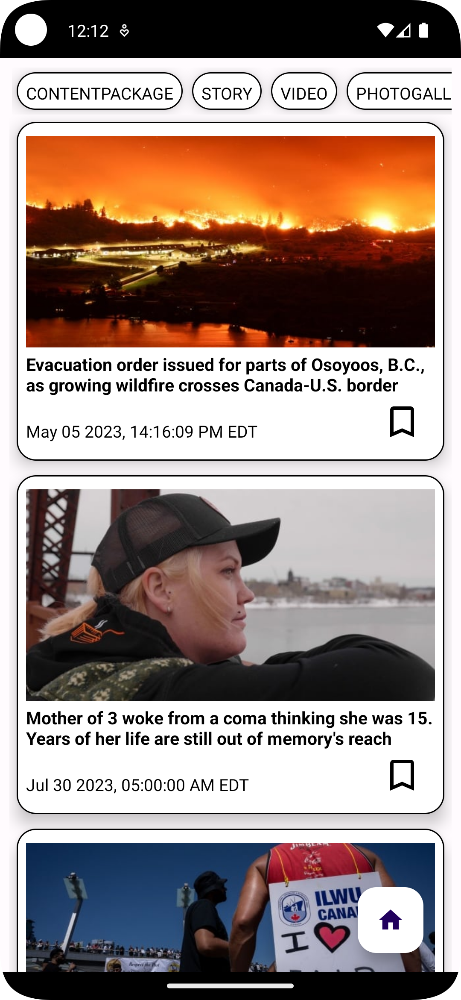
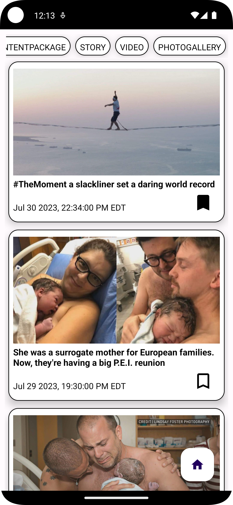
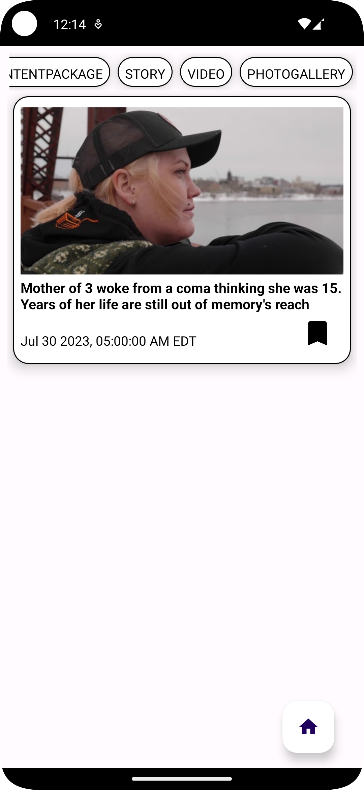
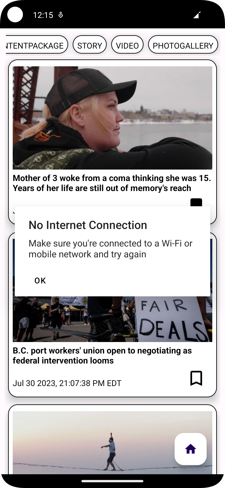

<h1 align="center">NewsFeed</h1>

## Introduction
NewsFeed is a Native Android Application that fetches news data from CBC News Api and displays the news feed.

## Screenshots

<p align="center">      </p>

## Base Features

- [x] App fetches news content from CBC Api and shows in the app with Android View.
- [x] Filterers the news feed by the dynamic "type" field from the Api.
- [x] When App loses network connection it notifies the UI.
- [x] 2-3 Unit and/or UI Tests.
- [x] A Readme file to onboard a developer.

## Bonus Features

- [x] Data persistence.
- [ ] Pagination.

## TO-DO
- [ ] Fix the label bug when saving each News Item.
- [ ] Fix ui when we save each item (when saving data it goes straight to offline mode ~ This can be fixed by creating two fragments and observe each data source in each fragments).
- [ ] More Unit tests with Mockk or Mockito

## Insights
- Based on the scope of project and requirement decided to go with Model- View - Model Architecture.
- Decided not implement dependency injection for the simplicity and maintainability and reduction of overhead in terms of setup and initialization
- Chose recycler view over list view based on it's performance, flexibility, Customizability, Separation of concerns and Integration with DiffUtil
- Used horizontal- recycler view for filtering because of the dynamic nature of "type" data coming from api
- Used Floating action button to load all news again after filtering.

## Architecture Diagram - MVVM


### Built With

* [Kotlin](http://kotlinlang.org/) - *Kotlin for Android is a modern, expressive programming language designed for Android app development. It offers concise syntax, null safety, and seamless interoperability with Java, making it a popular choice among Android developers.
* [Retrofit](https://square.github.io/retrofit/) - REST Client Library
    * Retrofit is a widely used library for Android app development, providing a simple and efficient way to make network requests. It offers a concise and intuitive API, enabling developers to handle RESTful APIs easily and seamlessly integrate them into their Android apps.
* [Glide](https://bumptech.github.io/glide/) - Image Loading Framework
    * Glide is a popular image loading and caching library for Android, designed to efficiently load and display images in apps. It offers a simple API and supports various image formats, resizing, and transformations, making it easy for developers to handle image loading and caching tasks in Android applications
* [Room](https://developer.android.com/jetpack/androidx/releases/room) - ORM
    * ROOM is an Android architecture component that simplifies local database management by providing an easy-to-use abstraction layer over SQLite. It offers efficient data access and supports data migrations, making it a popular choice for Android app developers.
###### Check Build
```bash
# Checks build and lint
$ ./gradlew build check
```
###### Unit Test
```bash
# Execute local unit tests
$ ./gradlew test
```
###### Instrumented Test
```bash
# Start Android emulator
$ ./emulator -avd <name_of_emulator>
```
###### Execute instrumented tests
```bash
$ ./gradlew connectedAndroidTest

Test results: path_to_app/app/build/reports/androidTests/connected/ directory
```